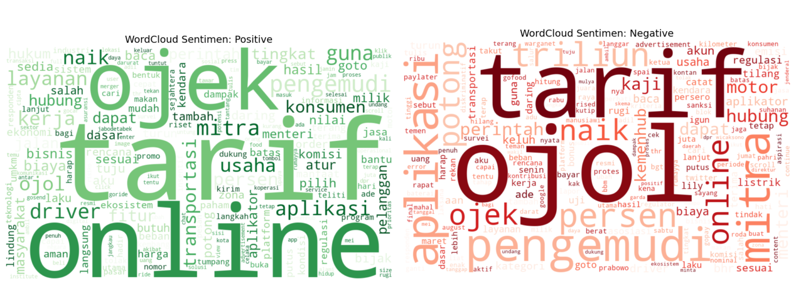
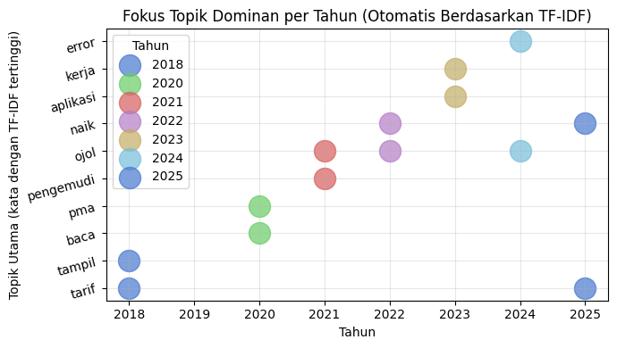
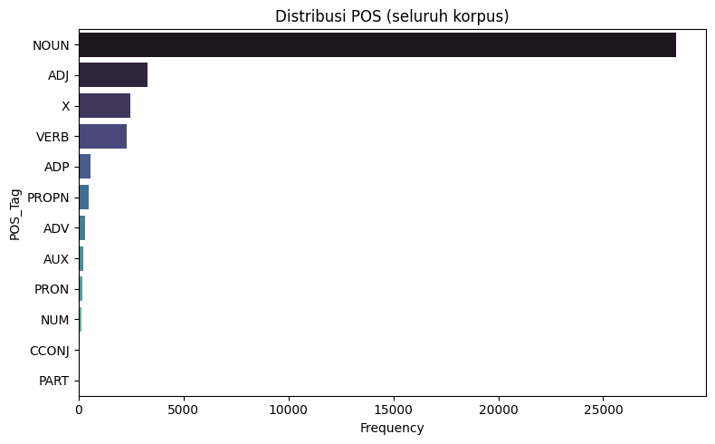

# 📄 README: Analisis Sentimen Berita Gojek menggunakan IndoBERT dan TF-IDF

## 📌 Judul

**Analisis Sentimen Berita dan Opini terhadap Gojek melalui Web Scraping pada Media Online**

## 👥 Anggota Kelompok

- Malvin Reynara Jawakory (5026221188)
- Muhammad Irfan Almizan (5026221065)
- Luthfi Rihadatul Fajri (5026221077)

## 🏢 Institusi

Departemen Sistem Informasi, Fakultas Teknologi Elektro dan Informatika Cerdas (FTEIC), Institut Teknologi Sepuluh Nopember (ITS), 2025

---

## ✨ Abstrak

Analisis sentimen otomatis terhadap berita daring yang membahas layanan Gojek, menggunakan pendekatan Natural Language Processing (NLP) dan model Logistic Regression + TF-IDF.
Proyek ini dikembangkan sebagai bagian dari mata kuliah Pengolahan Bahasa Alami (PBA) — Departemen Sistem Informasi, Fakultas Teknologi Elektro dan Informatika Cerdas, Institut Teknologi Sepuluh Nopember (ITS), Semester Gasal 2025.

---

## 📚 Struktur Laporan

### 1. Pendahuluan

Seiring meningkatnya penggunaan layanan Gojek di Indonesia, persepsi publik melalui media menjadi penting untuk dianalisis.
Penelitian ini bertujuan untuk:

1. Mengumpulkan berita daring terkait Gojek.
2. Melakukan pra-pemrosesan teks (cleaning, tokenizing, stopword removal, stemming).
3. Membangun model klasifikasi sentimen menggunakan TF-IDF dan Logistic Regression.
4. Mengevaluasi performa model dan memetakan tren pemberitaan terhadap Gojek.

Hasilnya diharapkan membantu memahami citra publik dan persepsi media terhadap Gojek secara kuantitatif dan visual.

### 2. Tinjauan Pustaka

- Akuisisi Data: Teknik manual dan otomatis (BeautifulSoup, Google Dorking).
- Preprocessing: Tokenisasi, stopwords, stemming, lemmatization.
- Analisis Sentimen: Pendekatan berbasis leksikon dan pembelajaran mesin.
- TF-IDF: Bobot kata penting.
- POS Tagging dan NER: Struktur sintaksis dan pengenalan entitas.
- Transformer dan BERT: Keunggulan arsitektur dan IndoBERT untuk Bahasa Indonesia.

### 3. Akuisisi Data

- Pengumpulan 177 artikel berita tentang Gojek dari berbagai portal (Tempo, CNN Indonesia, Kompas, Liputan6, dll).
- Proses dilakukan secara manual crawling dan scraping konten menggunakan library newspaper3k.

### 4. Data Preprocessing

- Case folding → ubah ke huruf kecil.
- Punctuation removal → hapus tanda baca & karakter khusus.
- Tokenizing → pecah teks jadi token kata.
- Stopword removal → hapus kata tidak bermakna (“yang”, “di”, “dan”).
- Stemming → gunakan library Sastrawi untuk mengembalikan kata ke bentuk dasar.

### 5. Ekstraksi Fitur

Gunakan TF-IDF (Term Frequency – Inverse Document Frequency) untuk mengubah teks menjadi vektor numerik yang mewakili bobot penting setiap kata.

### 6. Pemodelan

Model klasifikasi menggunakan:

Algoritma: Logistic Regression

Feature Extraction: TF-IDF

Train-Test Split: 80:20

### 7. Definisi Dataset

- Dataset terdiri dari: No, Title, Source, URL, article_text, tanggal, cleaned_text, tokens, stemmed_tokens, stemmed_text, polarity, sentiment, dan tag.
- Versi setelah preprocessing mencakup fitur hasil pembersihan teks seperti cleaned_text, tokenisasi (tokens), stemming (stemmed_text / stemmed_tokens), serta skor dan label sentimen (polarity, sentiment).

## 📈 Evaluasi Akhir Model

| Kelas   | Precision | Recall | F1-Score |
| ------- | --------- | ------ | -------- |
| Negatif | 0.94      | 0.80   | 0.86     |
| Netral  | 1.00      | 0.95   | 0.97     |
| Positif | 0.79      | 0.95   | 0.86     |

### 8. Analisis Data

#### 8.1 Analisis Sentimen

Menampilkan kata yang paling sering muncul berdasarkan sentimen positif dan negatif.

- Kata dominan positif: layanan, guna, driver, fitur.
- Kata dominan negatif: tarif, akun, kendala, kemenhub.

- Tren pemberitaan meningkat pada periode tertentu, bergantung pada peristiwa dan kampanye terkait Gojek.

#### 8.2 Analisis TF-IDF

Menunjukkan topik populer tiap kuartal (2023–2025):

- 2023: fokus pada tarif & fitur.
- 2024: isu hukum & keluhan layanan.
- 2025: relasi mitra dan kampanye perusahaan.

#### 8.3 Analisis POS dan NER

- POS paling sering: NOUN (28.475) → fokus pada entitas nyata seperti tarif, mitra, driver.
- NER dominan: ORG (Gojek, GoTo, Pemerintah) & GPE (Jakarta, Indonesia).

#### 8.4 Perbandingan Model Sentimen

- F1-Score Positif: 0.87, Negatif: 0.83, Netral: 0.75

- Confusion Matrix TF-IDF + SVM:

- Distribusi prediksi per model dibandingkan dengan label asli:

### 7. Kesimpulan

- Sentimen publik terhadap Gojek cenderung netral secara umum, dengan polaritas muncul pada isu-isu layanan, tarif, dan dampak sosial ekonomi.
- Insight ini dapat dimanfaatkan oleh perusahaan dan media untuk mengelola komunikasi publik secara lebih responsif.

---

## 🛠️ Tools dan Teknologi

- Bahasa Pemrograman: Python
- Library: BeautifulSoup, scikit-learn, HuggingFace Transformers, PyTorch, PySastrawi, NLTK, spaCy
- Model: IndoBERT-base-p1, Logistic Regression, SVM

---

---

## 📌 Referensi

- Devlin et al. (2019). BERT: Pre-training of Deep Bidirectional Transformers for Language Understanding.
- Jurafsky & Martin (2020). Speech and Language Processing.
- Cambria et al. (2013). New Avenues in Opinion Mining and Sentiment Analysis.
- Kowsari et al. (2019). Text Classification Algorithms.
